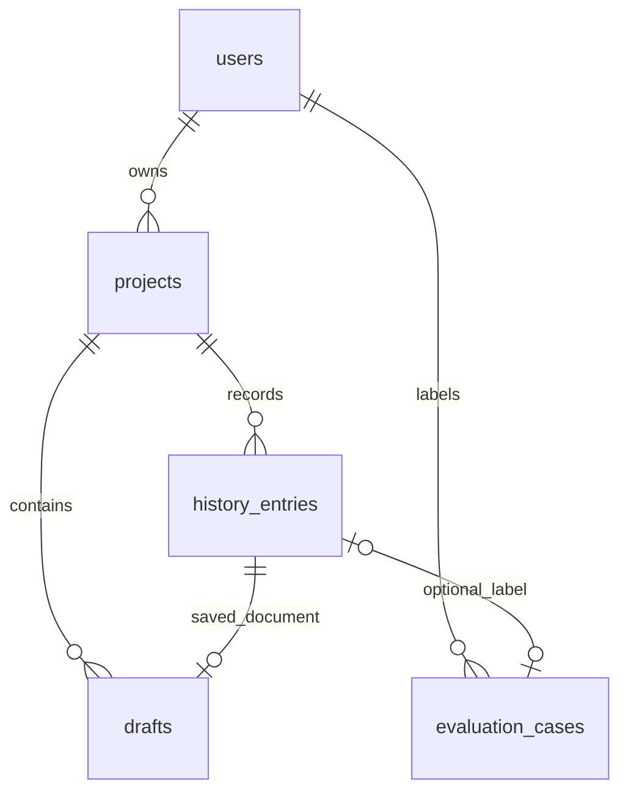

# ANY-639: data model and Python contracts

Approved architecture: async SQLAlchemy 2.0 with Psycopg 3, Pydantic 2 contracts,
explicit Unit of Work, verified Alembic baseline and connectivity readiness.
Implementation inherits from `origin/codex/any-638-frontend-backend-foundation`,
commit `9d317c391254ae06424c195536ab94e437d9cb3c`, on
`codex/any-639-data-contracts-and-alembic` in the approved existing checkout.

## Scope and alternatives

Python prepares persistence without receiving business traffic. Next.js keeps
auth, business APIs, proofs and current writes. Drizzle remains the sole
application migration owner. No startup migration, schema redesign, event table
or snapshot trigger is added. The exact baseline is the current schema and real
Drizzle journal/migrations 0000–0006, including the 0006 evaluation cascade.

Async sessions fit future async FastAPI handlers without blocking the event loop.
They add cancellation and transaction complexity, covered by the Unit of Work
tests. Sync SQLAlchemy is simpler for sequential scripts and is used by the
explicit verification CLI; future async handlers would require thread offloading
if they used it. Psycopg on Windows requires the documented selector loop factory.
An empty stamp without inspection or ORM create_all at startup was rejected:
neither proves compatibility or safely preserves a populated schema.

## ER model

Every FK deletes with CASCADE. An unlinked evaluation survives project deletion
and remains owned by its user. FKs do not prove evaluation owner equals history
owner, or draft history belongs to draft project: owner-scoped joins and use
cases must enforce those rules in ANY-640. No composite FKs are introduced.

## Dictionary and Drizzle/Python mapping

All table IDs are non-null UUID primary keys with gen_random_uuid() server
default, mapped to Python UUID. Listed timestamps are non-null timestamptz with
now() server default and timezone-aware datetime. Date maps to Python date; text
to str; JSONB to dict; numeric(14,2) to Decimal. `?` means nullable. Updated
timestamps are explicitly assigned on edits, with no new trigger. API camelCase
and monetary strings remain the wire form, while evaluation JSONL is snake_case.

| Table / SQLAlchemy row | Drizzle → SQL columns and types | Pydantic / domain mapping |
|---|---|---|
| users / UserRow | id; email text UNIQUE; passwordHash → password_hash text; createdAt → created_at timestamp | UserResponse exposes only id/email; hash stays internal |
| projects / ProjectRow | id; userId → user_id UUID FK users; name text; client text?; industry enum; scope text; startDate → start_date date?; pricingModel → pricing_model enum?; currency enum?; hourlyRate → hourly_rate numeric?; fixedPrice → fixed_price numeric?; lastChecked → last_checked date?; createdAt → created_at timestamp | CreateProjectRequest; complete-card UpdateProjectRequest; ProjectResponse. SQL client maps to clientName. CommercialTerms represents active commercial rules only |
| history_entries / HistoryEntryRow | id; projectId → project_id UUID FK projects; date date; request text; verdict enum; summary text | HistoryEntryResponse; derived optional draftId; no fabricated analysis for historical rows |
| drafts / DraftRow | id; projectId → project_id UUID FK projects; historyEntryId → history_entry_id UUID UNIQUE FK history; idempotencyKey → idempotency_key UUID; projectSnapshot → project_snapshot JSONB?; analysisSnapshot → analysis_snapshot JSONB; draftDocument → draft_document JSONB; locale text; requestLanguage → request_language text?; clientMaterialLanguage → client_material_language text; changeOrderLabels → change_order_labels JSONB?; status text DEFAULT draft; createdAt/updatedAt timestamps | ProjectSnapshot; AnalysisSnapshot; DraftDocument; CreateDraftRequest; UpdateDraftRequest; DraftResponse; DraftListItem. Domain protected-field comparison |
| evaluation_cases / EvaluationCaseRow | id; userId → user_id UUID FK users; historyEntryId → history_entry_id UUID? UNIQUE FK history; scope/request text; aiVerdict → ai_verdict enum; humanVerdict → human_verdict enum?; aiReasoning → ai_reasoning text; accuracy enum; industry enum; createdAt/updatedAt timestamps | EvaluationLabelRequest; EvaluationResponse; EvaluationJsonlRecord. Domain human-verdict resolution |

PostgreSQL enum labels/order are preserved: industry Development/Design/Marketing;
verdict in_scope/borderline/out_of_scope; pricing_model hourly/fixed; currency
RUB/USD/EUR; evaluation_accuracy correct/wrong/debatable. SQLAlchemy stores values
rather than Python member names.

The packaged baseline_schema.json records every column, default, named constraint,
index and enum from actual Drizzle replay with SQL SHA256/journal provenance.
Named invariants include users_email_unique, drafts_history_entry_id_unique,
drafts_project_creation_key_unique(project_id,idempotency_key),
drafts_project_created_at_idx(project_id,created_at),
evaluation_cases_history_entry_id_unique, projects_commercial_terms_consistent,
drafts_status_valid, drafts_locale_valid and evaluation_cases_accuracy_human_verdict.
Index direction and all FK names/actions remain identical.

The original project CHECK retains SQL three-valued/null semantics. Legacy rows
may have nullable commercial fields; new complete project cards require valid
date/pricing/currency and a positive active amount below 1e12 with at most two
decimals, normalizing the inactive amount to null. Decimal calculations never
use binary float arithmetic. Reads expose historical nulls without substituting
current terms. Domain dataclasses are not duplicated for each database row.

## Contracts and invariants

Pydantic schemas live in modules/auth, projects, analysis, change_orders, drafts
and evaluations. They prepare transport and persisted JSON contracts; they add
no business routes. Exact response wrappers, errors, cookies and proof
interoperability remain mandatory ANY-640 integration checks.

Draft v1 retains result, required-nullable clientMaterials/changeOrder, reply
{tone,text,generated}, and projectDetails {clientName,clientEmail,endDate}.
Editable strings may be empty and are capped at 100,000 characters; draft JSON
is capped at 1,000,000 UTF-8 bytes. Reply tones are warm/neutral/firm. Saved
change orders keep all existing editor fields, createdAt, language, optional
reference/aiValues/labels, currency and noAdditionalCharge. Documents are read
as saved, not regenerated.

AnalysisSnapshot retains verdict/confidence/summary/reasoning/citations and
optional suggestion/replies/changeOrder, request/client language, additional-work
flag, commercialSignature, draftCreatedAt and estimateValid. Reads do not
recalculate commercial estimates. ProjectSnapshot v1 retains nullable terms,
legacy optional clientName, endDate and documentLanguage. SQL-null legacy project
snapshots remain null, never replaced with mutable current project state.

Project end date and client email remain browser-local project fields. Existing
captured values inside document/snapshot JSON remain supported; no project
columns are introduced. Current language metadata and label sets are retained.
Client-material language tags canonicalize casing/registered aliases before
supported-language/script checks. Langcodes preserves explicit script subtags;
a bounded obsolete-region correction matches the frontend Intl behavior for
SU/810/172 in supported languages. Saved snapshot tags remain preserved.
Exact generation-language canonicalization and JavaScript parser/error parity
belong to ANY-640 route integration.

The browser submits a signed proof, not authoritative snapshots. ANY-640 must
verify existing HS256 proof expiry, issuer scope-creep-guard, audience
draft-creation and owner/project/request/locale bindings with the separately
derived scg-draft-proof-v1 signing key. Session cookies cannot authorize snapshot
claims. Immutable protected fields are verdict, confidence, summary, reasoning,
citations, suggestion, hasAdditionalWork and requestLanguage, including
missing-versus-present values. Editable draft JSON is separate from immutable
analysis/project snapshots; no database trigger is added.

Evaluation correct resolves human verdict to AI verdict; debatable resolves to
null; wrong requires a supplied different verdict. The database independently
checks this relationship. Evaluation snapshots keep original scope/request/
reasoning rather than joined mutable project values. No credentials enter exports.

| Layer | Responsibility |
|---|---|
| Pydantic/API | Input shape/types/primitive values, dates, decimal normalization, text/byte limits and response serialization |
| Use case/domain | Ownership, proof trust, state transitions, immutable snapshots, commercial rules, evaluation resolution and atomic idempotency |
| Database | Existing FKs, uniqueness, checks, indexes and cascades |

## Session, repositories and Unit of Work

Lifespan owns one lazy engine/session factory and disposes it at shutdown. Import
and startup connect to no database. Each use case gets a separate Unit of Work;
concurrent tasks never share a session. Preparation defaults: pool size 5,
overflow 5, pool timeout 1 second, connection timeout 2 seconds, statement timeout
2 seconds, pre-ping enabled. Reassess these against actual business workloads at
cutover; they are not a universal request timeout.

Autoflush/autobegin are disabled and expire_on_commit is false. Entry begins one
transaction; commit is explicit. Exit without commit, exception or cancellation
rolls back and closes. Finished instances cannot be reused. Repositories may
flush but do not commit; HTTP response completion cannot hide a commit.

ANY-640 introduces owner-scoped repository ports and SQLAlchemy adapters for
projects/history, drafts and evaluations, coordinated by the same Unit of Work.
Rows stay internal. Owner filtering joins through projects/users and preserves
existing indistinguishable absent/foreign-resource behavior.

Atomic draft creation locks the owned project, looks up
(project_id,idempotency_key), returns an existing saved result, otherwise writes
history+draft+last_checked and commits once. Failure rolls back every write;
the unique index is the final concurrent-writer defense. A retry gets a fresh
transaction. This business use case is deliberately not implemented in ANY-639.

## Safe Alembic strategy

Fixed revision 0001_existing_drizzle_schema uses explicit DDL independent of live
ORM metadata. It reproduces the schema, not Drizzle's bookkeeping table.
Application startup never calls create_all/upgrade/stamp. Direct unguarded
Alembic commands are refused; baseline downgrade refuses destructive deletion.

The CLI explicitly selects a named URL environment variable; it never implicitly
uses application settings. Mutation requires --disposable, the test-only variable,
loopback host and harness-style user/database, rejecting target query overrides
and inherited PGSERVICE/PGSERVICEFILE/PGHOSTADDR/PGPORT for mutation commands.
These guards supplement ownership by the disposable harness, not permission to
relabel application URLs. Production adoption is outside ANY-639 execution.

For an empty disposable database, upgrade-empty rejects existing public objects,
creates the baseline and verifies it in one transaction. For a populated
disposable database, adopt-baseline checks compatibility before touching the
Alembic ledger, locks five tables, checks again and stamps the fixed revision.
All business rows and the Drizzle ledger are preserved. Same verified revision
is a no-op; mismatches or unexpected revisions reject. There is no purge/repair.

Catalog comparison requires PostgreSQL 17 and verifies types/precision,
nullability/defaults, enum order, FK actions, keys, CHECK expressions/validation/
deferral, named indexes/validity, table kind, RLS and noninternal triggers.
Managed tables reject additional columns/checks/indexes. OIDs and physical
column order are ignored. Unrelated tables/schemas are outside the boundary.
Errors expose schema paths, not row contents or connection secrets.

Table locks do not replace a migration freeze, particularly for enum DDL.
Future handover needs separate approval: freeze changes, finish Drizzle, verify
backup/recovery and compatibility, stamp, preserve the old ledger, disable every
Drizzle runner, then enable exactly one Alembic runner. No hidden ownership
transfer happens in this deployment. Application rollback restores Python
image/config without dropping the shared schema or reversing a valid stamp.

## Readiness and deployment

/health/live remains 200 {status:ok} without external dependencies.
/health/ready performs SELECT 1 within a 3-second overall deadline and uses
Cache-Control:no-store: available database gives 200 {status:ok,database:ok};
missing/invalid/unreachable/timed-out database gives sanitized 503
{status:unavailable,database:unavailable}. It proves connectivity only; exact
schema preflight is separate and explicit.

Compose supplies prefixed database configuration; the existing Drizzle job still
runs before Next.js. Python can start independently while PostgreSQL is down.
Deploy the existing Drizzle schema/job first, then Python preparation, then
check readiness/preflight. No business routing changes in this issue.

## Analytics/audit: decision remains open

ANY-639 adds no event records. A separate approved task must choose among:

| Option | What it stores and why | Retention/trust considerations |
|---|---|---|
| No event records | Existing business records and operational health/errors; least extra data | Limited support chronology |
| Server audit | Selected actor/action/resource/outcome/time/correlation metadata for authoritative mutation history | Restricted access, explicit retention/erasure; server facts |
| Product analytics | Aggregate feature usage/coarse outcomes with minimized identifiers | Consent/opt-out and short retention to decide; untrusted client events cannot prove authorization |
| Both separately | Independent audit and product purposes/schemas/access policies | Separate trust and retention, no catch-all shared event table |

Every option avoids keystrokes, full messages/documents, credentials, proof tokens
and unnecessary private content. Existing Vercel Analytics is unchanged. Omitting
tables here does not permanently settle the product decision.

## Verification and follow-ups

Tests use an owned volume-free PostgreSQL 17 container and unique databases,
never application DATABASE_URL. They independently replay real Drizzle, create
the Alembic baseline and ORM metadata, compare catalogs, seed populated records,
and compare every row/old ledger before/after adoption. Drift covers missing/
extra columns/tables, precision, nullability, defaults, enums, same-name changed
checks, cascades, indexes and RLS. Contracts, Decimal/JSON round trips, UoW
cleanup and readiness are tested. CI requires integration collection and Docker;
infrastructure failure cannot silently skip PostgreSQL coverage.

The exact file/implementation order is in plans/2026-10-09-any-639-data-contracts-and-alembic.md.
Factual checks and limitations belong in any-639-verification.md. ANY-640 owns
business repositories/use cases/auth/proof/routes and interoperability; ANY-641
owns PDF/extraction/currency; ANY-642 reassesses integration gaps. Production
handover and analytics/audit require separate approved decisions.
